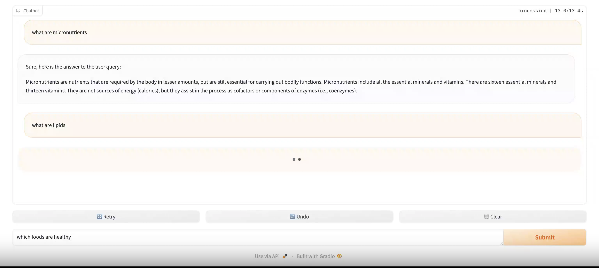

# LocalRAG
This project is a Local Retrieval Augmented Generation (RAG) pipeline built from scratch without using frameworks such as Langchain. The pipeline is connected to a local LLM and is deployed as a chatbot via Gradio. The source material is "Human Nutrition: 2020 Edition"

# Models Used
1. Embedding Model: all-mpnet-base-v2
1. LLM Model: Gemma IT (the specific type varying depending on hardware capabilities)

# Examples of the chatbot in action
## Screenshot


## Gif (original Size)


## Gif (compressed and sped up with 1.5x speed)


# Requirements
- PyMuPDF==1.23.26
- matplotlib==3.8.3
- numpy==1.26.4
- pandas==2.2.1
- Requests==2.31.0
- sentence_transformers==2.5.1
- spacy
- tqdm==4.66.2
- transformers==4.38.2
- accelerate
- bitsandbytes
- jupyter
- wheel
- gradio
- huggingface-hub

# Usage
## If Run Locally
### Create Environment
type this command in terminal/cmd/conda prompt: <br>
```conda env create -f environment.yml```
### Install Requirements
```pip install -r requirements.txt```
### Run either main.py or app.py
```python main.py``` or ```python app.py```
Where app.py contains the gradio deployment for this project and main.py runs the project through user input the terminal.

## Run on Google Colab
1. Upload ```run_on_colab.ipynb``` to google colab
2. Clone this repo to google drive
3. open ```run_on_colab.ipynb```
4. adjust the path in google colab accordingly
5. run the cell blocks

## Note
This projects requires a CUDA-compatible GPU to run

# To-Do
- [ ] Enable the chatbot to respond using query history as well
- [ ] Improve text preprocessing to get better RAG performance
- [ ] Integrate a re-ranker model to get better RAG results
- [ ] Improve prompt

# Contributions
1. Many thanks to Daniel Bourke for the video guidance on this project
2. Many thanks to the University of Hawai‘i at Mānoa Food Science and Human Nutrition Program for the open source textbook "Human Nutrition: 2020 Edition" which was used as the source material for this project

